## Mermaid

Mermaid - это сильно упрощённый и далёкий аналог UML - специальный язык описания блок-схем, графиков и диограм с их визуализацией.

Блок схемы

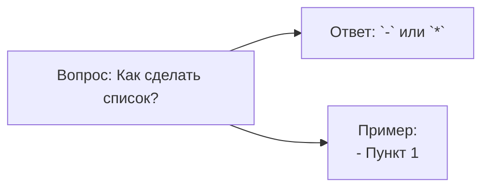
* flowchart - блок-схема
* LR - направление вправа
* A[], B[], C[] - прямоугольник
* --> - стрелка связи
#### Базовая структура 2
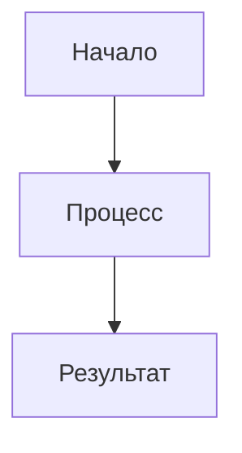
#### Полный синтаксис блок-схем
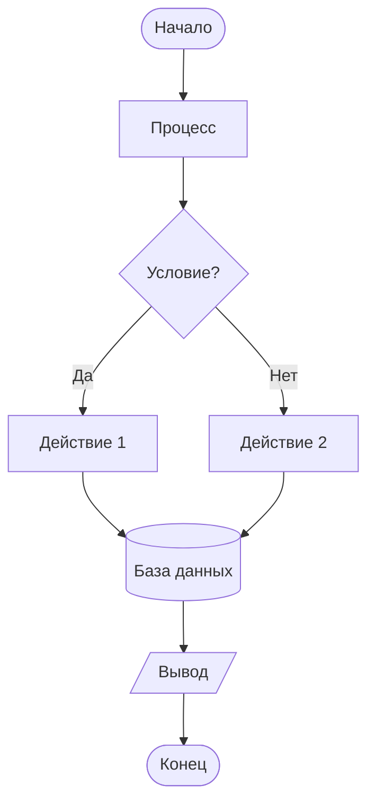
### Диаграмма последовательности
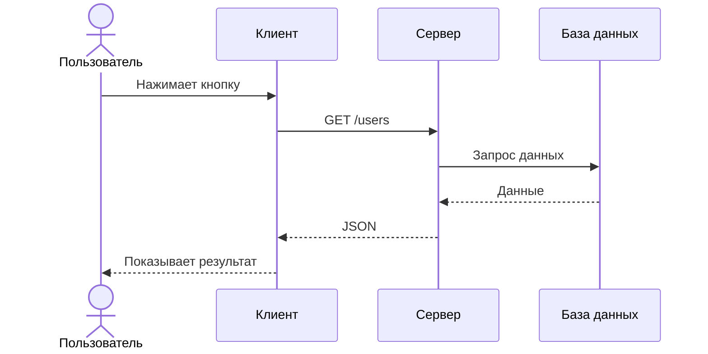
### Диаграмма класса

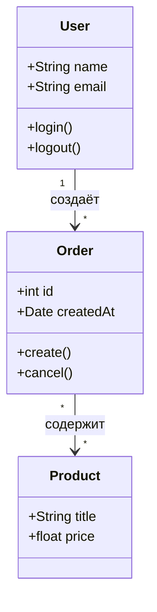

### Диаграмма Ганта

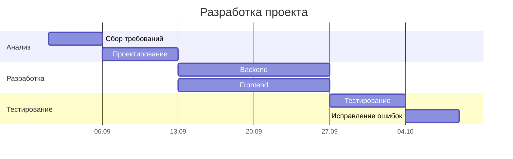

### Граф зависимостей
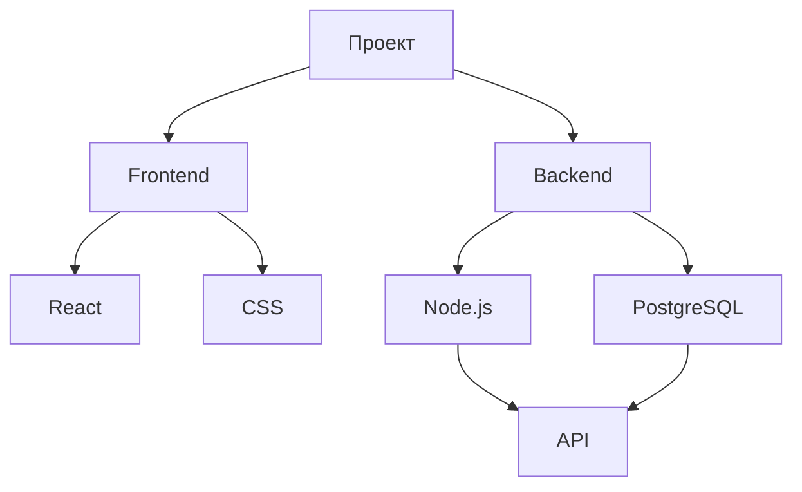
### Диаграмма состояний

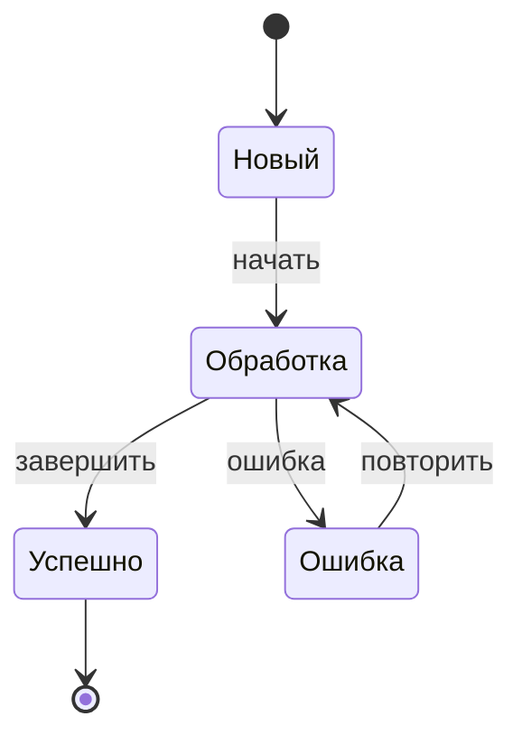
### Юзер-джайрни

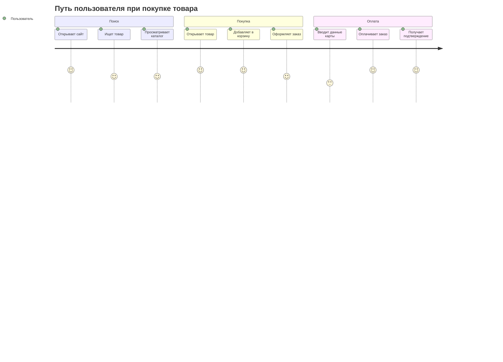
### Кастомизация стилей

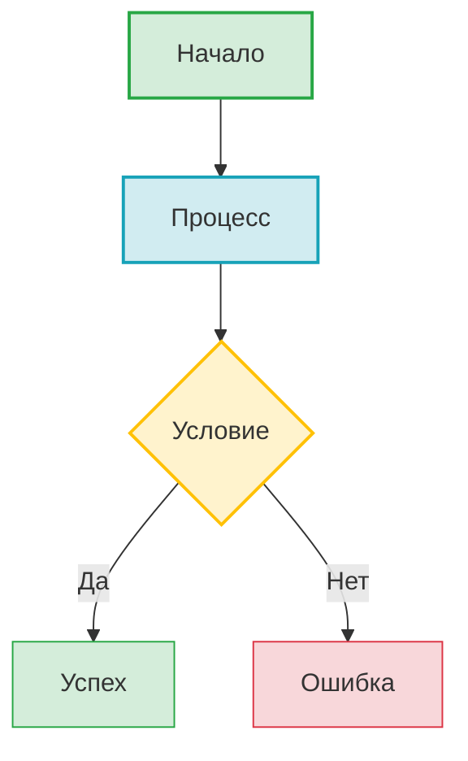
#### Классы CSS

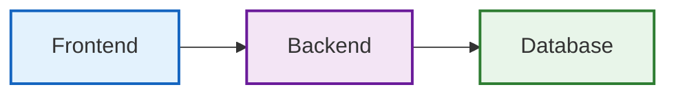
#### Интерактивность

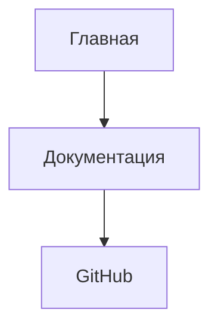

### Круговая диграмма
Круговая диограмма
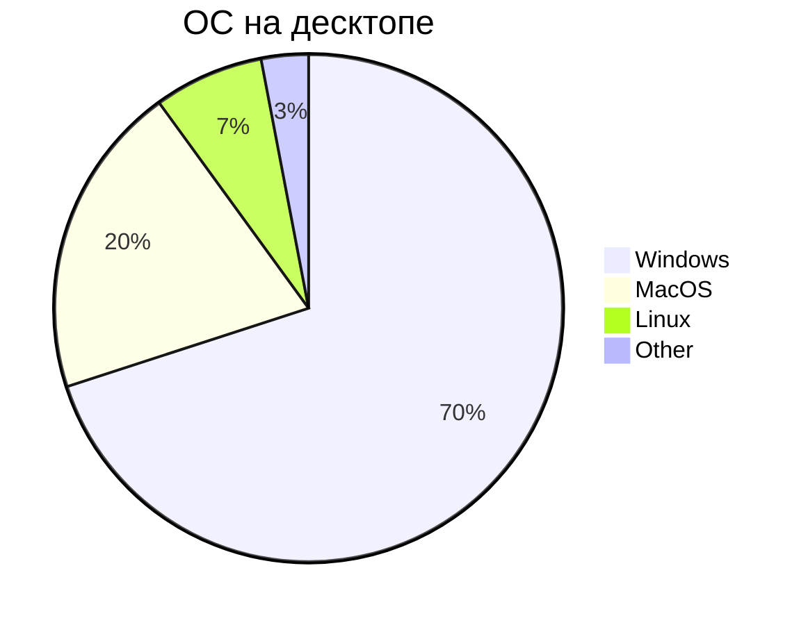